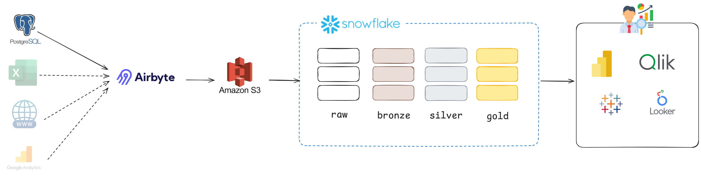

# Olist Lakehouse PoC – Snowflake

## 📌 Objetivo do Projeto
Esta Proof of Concept (PoC) teve como objetivo **avaliar o Snowflake como plataforma de dados** para implementação de uma arquitetura **Lakehouse / Medallion (Bronze, Silver, Gold)**, considerando:

- Modelagem analítica
- Estratégias de carga (rebuild vs incremental)
- Uso de Dynamic Tables
- Governança e organização de código
- Comparação prática com outras plataformas do mercado

O foco foi **exploração técnica e arquitetural**, não a construção de um pipeline produtivo completo.


---

## 🏗️ Arquitetura Implementada




### 🔹 Bronze
- Camada de ingestão
- Estrutura espelhada da fonte
- Sem regras de negócio
- Dados tratados como “raw confiável”

Tabelas:
- customers
- orders
- order_items
- products
- sellers

---

### 🔹 Silver
- Camada de padronização e conformidade
- Tipagem de dados
- Normalização de texto
- Aplicação de MERGE quando necessário
- Criação de tabelas intermediárias para simplificar joins

Destaque:
- `ORDER_DETAILS`: junção entre cabeçalho (`ORDERS`) e itens (`ORDER_ITEMS`), servindo como base estruturante para a Gold

---

### 🔹 Gold
- Camada orientada a consumo analítico
- Modelo estrela
- Dimensões simples com rebuild
- Fato construída a partir de regras de negócio

Objetos:
- DIM_CUSTOMERS
- DIM_PRODUCTS
- DIM_SELLERS
- FT_ORDERS (Dynamic Table)

---

## 🧠 Decisões Arquiteturais Importantes

- **Rebuild completo** para dimensões simples (SCD Type 1)
- **MERGE apenas onde há mutabilidade real**
- **Hash aplicado na transição Silver → Gold**
- Uso de **Dynamic Table** na fato principal para evitar MERGE manual
- Criação de **tabelas de controle** para avaliar orquestração escalável
- Separação conceitual entre **dados analíticos** e **objetos de controle**

---

## 🚫 O que não foi implementado propositalmente
- Tasks e Procedures em produção
- Automação completa
- CI/CD funcional

Esses pontos foram avaliados conceitualmente, mas não implementados por não agregarem valor adicional à PoC de exploração.

---
## 🧩 Estrutura do Repositório

```bash
poc-snowflake/
├── raw/
├── bronze/
├── silver/
├── gold/
control/
docs/
```

---

## 🎯 Conclusão
A PoC cumpriu seu objetivo principal: **avaliar o Snowflake de forma prática, crítica e comparativa**, permitindo tomada de decisão consciente sobre o uso da plataforma em projetos futuros.


